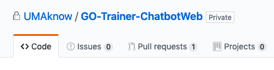
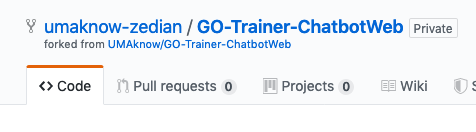
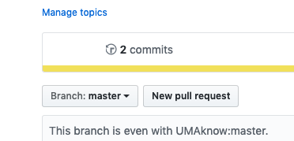

# Contributing

## Github

#### Github Fork

Comment le faire?

	- Trouver le Github repository de **UMAknow** sur lequel tu travailles
	- Cliquer sur le bouton *Fork* 

Cette action crée ta propre _server-side_ copie du _central_ repository. 

 

#### Git Clone

Ayant fait le `github fork` tu as maintenant une copie du repository sur ton propre Github. Mais tu ne peux toujours pas effectuer tes changements. 

Maintenant, tu as le choix d'effectuer les prochaines étapes à l'aide d'un des outils proposés ou bien suivre les commandes `bash` dans ce guide.

Le `git clone` prend un URL et copie le contenu ainsi que le *commit history* du repository sur ta machine locale. Git va également ajouter un _remote_ nommé **origin** qui pointe sur **ton** server-side repository, ce qui va te laisser de pousser tes changements vers ton server-side repository.

```bash
# cloner le repo
git clone username@host:/path/to/repository
```

#### Git Remote

Bien sur tu ne voudrais pas seulement effectuer des changements sur ta copie, mais aussi sur le repository central. C'est pourquoi t'aura besoin d'ajouter manuellement un autre remote que tu pourrais nommer _upstream_ (repository central)

Fait attention, tu ne pourras pas directement `git push` tes changements dans ce remote. On verra plus tard comment tu peux ajouter tes changements avec un _Pull Request_. 

```bash
cd <git-repo-name>
# ajouter une remote
git remote add upstream <server>
# voir toutes les remote existantes
git remote -v
```

#### Create bio

Crée ta biographie avec tes loisirs, etc. Tout ce que tu voudrais qu'on sache. :grin: 

Noter qu'on utiliser une commande bash pour écrire dans un fichier markdown. Tu pourrais utiliser d'autre éditeurs de texte (Notepad, Vim, etc.).

```bash
# Créer un fichier <name.bio> dans le dossier Employees et écrire bio
echo "Lorem Ipsum" >> Employees/<name.bio>.md
```

#### Git Commit

Maintenant que tu as effectué des changements, tu voudras pousser ces changements sur ton server-side repository. Mais en premier, il faut stage les changements que tu voudrais commit et ensuite les commit avec un message explicatif.

```bash
# Stage les changements
git add .
# Commit les changements
git commit -m "First commit: Introduction"
```

#### Git Push

Maintenant tu peux pousser tes changements sur ton repository. Fait attention, si tu crée d'autres branches, il faudra spécifier la branche auquel tu pousse tes commit.

```bash
# Pousser les changements
git push
```

#### Git Pull Request

Retourne sur Github et crée un Pull Request.



#### Sync Repository local au Repository Central

Il faut noter qu'avant chacun des Pull Request, il se peut que d'autres contributeurs aillent déjà effectué d'autres changements et que peut-être ta version du code n'est pas la plus récente. Donc, pour ne pas effacer les contributions des autres. Il faut toujours effectuer un `Sync` avant de créer ton pull request. Tu pourrais même le faire au fur-et-à-mesure. 

```bash
git checkout dev
git pull upstream dev
```


