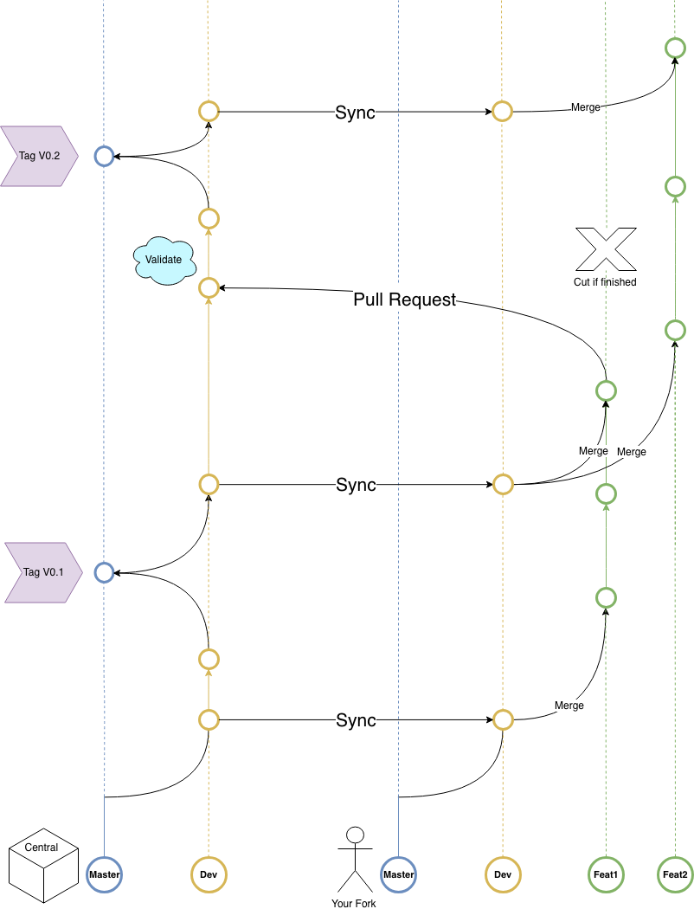

# Onboarding-UMAknow

## Fiche des nouveaux employés et Checklist

Ce document s'agit d'une manière intéractive à l'initialization en tant que nouveau employé chez UMAknow. Il est constitué d'une liste de tâches ainsi qu'une banque de connaissance à compléter afin de mieux comprendre le workflow ainsi que faciliter l'accès aux documents chez UMAknow.

## Liens et Ressources

| Titre     | Lien                                                         |
| --------- | ------------------------------------------------------------ |
| Team Site | [https://umaknow.sharepoint.com/sites/umaknow](https://umaknow.sharepoint.com/sites/umaknow) |
| Github    | [https://github.com/UMAknow](https://github.com/UMAknow)     |
| Jira      | [https://umaknow.atlassian.net/](https://umaknow.atlassian.net/) |

## Préparations avant ta première journée

| Fichiers à Remplir | Liens / Emails / Info |
| ------------------ | --------------------- |
| Lorem Ipsum        | Dolor sit amet        |

## GitHub Workflow

[Basic Git Commands](https://confluence.atlassian.com/bitbucketserver/basic-git-commands-776639767.html)

|      | :checkered_flag:     | Task                                            | Information / Aide     |
| ---- | -------------------- | ----------------------------------------------- | ---------------------- |
| 1    | :black_small_square: | Fork this Repository                            | [help](#git-fork)      |
| 2    | :black_small_square: | Clone your Fork on local computer               | [help](#git-clone)     |
| 3    | :black_small_square: | Add Remote `Upstream` this `central` repository | [help](#git-remote) |
| 4    | :black_small_square: | Create `bio.md` in folder Employees             | [help](#create-bio)              |
| 5    | :black_small_square: | Open Editor of choice and add bio in `bio.md`   | [help](#create-bio)              |
| 6    | :black_small_square: | `git commit` changes                            | [help](#git-commit)              |
| 7    | :black_small_square: | `git push` changes to your Fork                 | [help](#git-push)              |
| 8    | :black_small_square: | Create a Pull Request                           | [help](#git-pull-request)              |

#### Git Fork

Cette commande crée ton propre _server-side_ copy du _central_ repository. 

#### Git Clone

```bash
# clone repo
git clone username@host:/path/to/repository
```

#### Git Remote

```bash
cd <git-repo-name>
# add remote
git remote add upstream <server>
# check all remotes
git remote -v
```

#### Create bio

```bash
# Create file <name.bio> in Employees directory and write bio
echo "Lorem Ipsum" >> Employees/<name.bio>.md
```

#### Git Commit

```bash
# Stage changes
git add .
# Commit changes
git commit -m "First commit: Introduction"
```

#### Git Push

```bash
# Push changes
git push origin
```

#### Git Pull Request

Go back to github and create Pull Request from recent commit

#### Git Forking Flow




